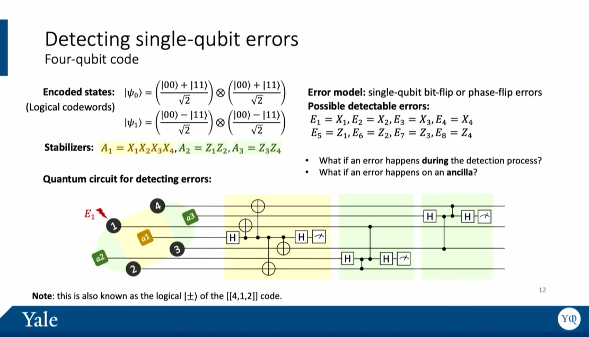

## TODO
`2026-05-11 14:06`
整理各平台的物理特性，比如：门参数、拓扑结构。
（optional）也可以提供一些物理实现上的想法。

- 为什么需要这些特性？

表面码的逻辑错误率本质上是由底层物理比特的连接性和门保真度决定的。


请参考 `template.png` 从以下这个框架来给出调研结果（结果写在 `survey` 目录下对应的文件夹中）：

1. 原生门集合与错误率： 单比特门、双比特门（如 CZ, CNOT）的平均保真度。（可根据各平台的物理特性来说明可能的原因）
2. 测量与重置时间： 这一点极其重要，因为表面码需要不断地循环测量 Stabilizers（稳定子）。测量时间过长会导致数据比特发生严重的退相干。
3. 连接性约束限制： 遇到非相邻比特需要交互时，该平台的代价是什么？（是需要引入带噪的 SWAP 门，还是需要物理移动比特？）

# QI2026 Surface Code Study

比较三种量子硬件平台（超导、中性原子、离子阱）上表面码的逻辑错误率，支持多种解码器（MWPM、Union-Find）。

## 平台

| 平台 | 代表 | 主要噪声源 |
|------|------|-----------|
| 超导 | Google Willow | idle 退相干 |
| 中性原子 | Bluvstein 2024 | 2Q 门错误 |
| 离子阱 | Quantinuum H2 | 测量错误 |

## 快速开始

```bash
pip install -e .
python -m surface_code_study.experiments.exp1_pl_vs_p   # PL vs p
python -m surface_code_study.experiments.exp2_pl_vs_d   # PL vs d
python -m surface_code_study.experiments.exp3_platform_compare  # 综合对比
```

## 依赖

- stim >= 1.11
- pymatching >= 2.0
- numpy, matplotlib, scipy

## 结果

图片和 JSON 保存在 `results/` 目录。

详细说明见 [surface_code_study/README.md](surface_code_study/README.md)。
